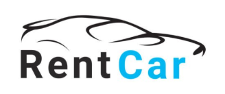

    

<!--# 🚗 RENT-CARS – Application de location de voitures-->
#  RENT-CARS – Application de location de voitures

**RENT-CARS** est une application web fullstack de location de voitures entre particuliers, développée avec les technologies modernes du web : React, TypeScript, Node.js, Express et MongoDB.

Ce projet a été réalisé dans le cadre du module *Technologie Web*, par un groupe de trois étudiants, avec une approche agile et une architecture MVC bien structurée.

<!-- **vous trouvrez lien en haut dans description** :
> 🔗 [Lien de la démo](https://rent-cars-omega.vercel.app/) -->

---

## 📌 Fonctionnalités principales

### 👤 Utilisateurs
- Inscription avec vérification par email
- Connexion / Déconnexion
- Modification du profil et de l'image de profil
- Réinitialisation de mot de passe
- Réservation de véhicules

### 🚘 Propriétaires (Renters)
- Ajout de véhicules avec images
- Modification et suppression de véhicules
- Gestion des disponibilités
- Suivi des réservations liées à leurs véhicules

### 🔐 Authentification & Sécurité
- Authentification JWT
- Middleware de protection d’API
- Rôles (user / renter / admin)

---

##  Aperçu de l'application


---

## 🛠️ Technologies utilisées

| Frontend              | Backend                   | Autres services              |
|-----------------------|---------------------------|------------------------------|
| React + TypeScript    | Node.js + Express         | MongoDB Atlas (base de données) |
| TailwindCSS           | REST API                  | Cloudinary (upload d’images) |
| React Router DOM      | JWT Authentication        | Nodemailer (emailing)        |
| Axios                 | Mongoose ODM              | GitHub Actions (CI/CD)       |
| Vite                  |                           | Vercel (déploiement) |

---

## 📂 Structure du projet

```
RENT-CARS/
├── frontend/ # Interface utilisateur (React)
├── backend/ # Serveur API REST (Node.js + Express)
```

---

## 🚀 Déploiement

<!-- > 🔗 [Lien de la démo](https://rent-cars-omega.vercel.app/) -->
- **Frontend** déployé sur [Vercel](https://vercel.com/)
- **Backend** <!--déployé sur [Heroku](https://heroku.com/) ou **AWS EC2**-->
- **Base de données** hébergée sur [MongoDB Atlas](https://www.mongodb.com/cloud/atlas)
- Intégration continue avec **GitHub Actions**

---

## ⚙️ Installation locale

### 1. Cloner le dépôt

```bash
git clone https://github.com/abdelfadelAchraf/RENT-CARS.git
cd RENT-CARS
```

### 2. Backend – Configuration & Lancement

```bash
cd backend
npm install
cp .env.example .env     # Créer un fichier .env avec les variables nécessaires
npm start              # Lancer le backend
```

### 3. Frontend – Lancement

```bash
cd frontend
npm install
npm run dev              # Lancer le frontend sur http://localhost:5173
```

## 📦 Variables d’environnement .env

### Backend:
```
PORT=5000
MONGODB_URI=...
JWT_SECRET=...
CLOUDINARY_CLOUD_NAME=...
CLOUDINARY_API_KEY=...
CLOUDINARY_API_SECRET=...
EMAIL_USER=...
EMAIL_PASSWORD=...
```

---

## 🧪 Tests

- Tests manuels réalisés sur les principales fonctionnalités : 
  - Authentification
  - Création / modification de voiture
  - Réservation
- Intégration des API testées via Postman

---

## Évolutions futures

- 📱 Application mobile React Native
- Système de notation & avis
- Google Maps pour la localisation des voitures
- Programme de fidélité
- 💬 Chat intégré avec le support
- Suggestions personnalisées par IA

---

## 👥 Équipe

>Achraf Abdelfadel [github.com/abdelfadelAchraf](https://github.com/abdelfadelAchraf)
---
> Zakaria Ennaqui [github.com/zakariaennaqui](https://github.com/zakariaennaqui)
---
> Imane Abasalah [github.com/amyaby](https://github.com/amyaby)

---

## 📄 Licence

Ce projet est réalisé dans le cadre pédagogique du module *Technologie Web* – Université 2025.

---

## 📬 Contact

Pour toute question ou suggestion :
> 📧 [contact@rentalcars-demo.com](mailto:contact@rentalcars-demo.com)
---
> 🔗 [github.com/rentalcars-project](https://github.com/rentalcars-project)
